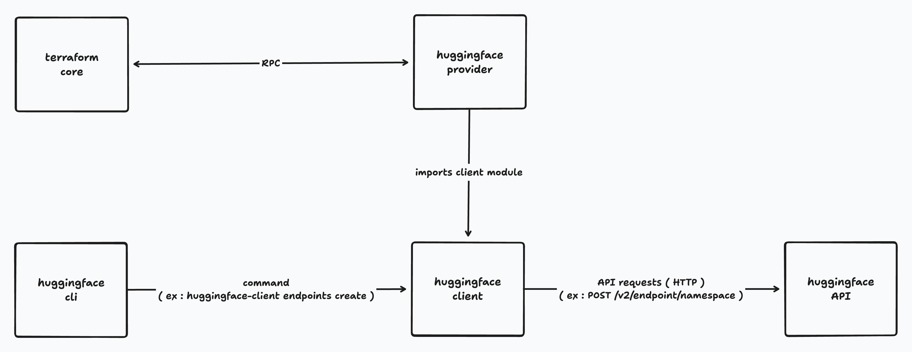

# Terraform Provider for Huggingface

The Terraform provider for Huggingface is a Terraform plugin to enable full lifecycle management of Huggingface resources.

## Usage

```
terraform {
  required_providers {
    huggingface = {
      source  = "sebps/huggingface"
      version = "~> 0.0.1"
    }
  }
}

provider "huggingface" {
  hf_token = "<YOUR_HF_TOKEN>"
}

resource "huggingface_endpoint" "example" {
  namespace = "<YOUR_NAMESPACE>"
  name      = "test-terraform-0"
  type      = "protected"

  compute = {
    accelerator   = "cpu"
    instance_type = "intel-icl"
    instance_size = "x4"
    scaling = {
      min_replica           = 3
      max_replica           = 5
      metric                = "hardwareUsage"

      measure = {
        hardware_usage = 10
      }
    }
  }

  model = {
    framework  = "pytorch"
    repository = "openai-community/gpt2"
    task       = "text-generation"
    image = {
      huggingface = {}
    }
  }

  cloud_provider = {
    region = "us-east-1"
    vendor = "aws"
  }
}

output "example_endpoint" {
  value = huggingface_endpoint.example
}
```

## architecture
